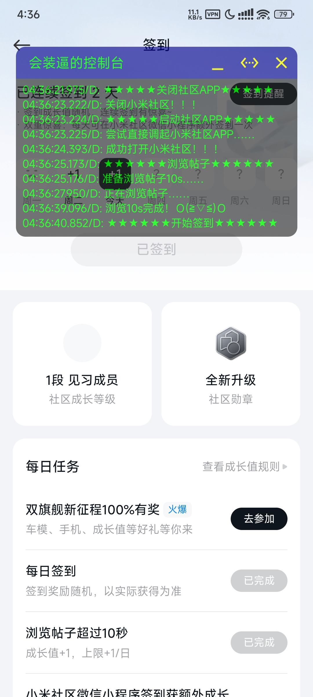
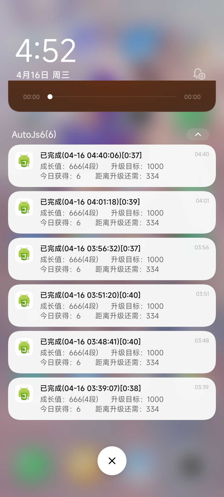
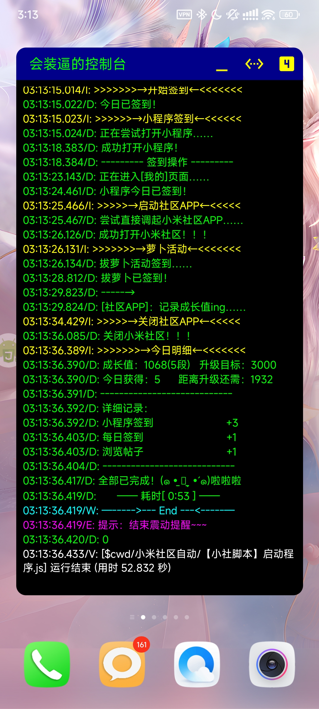
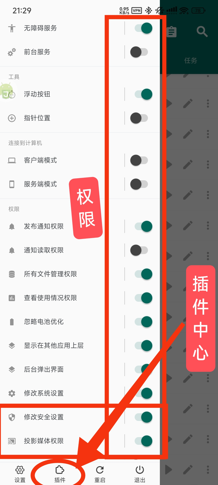
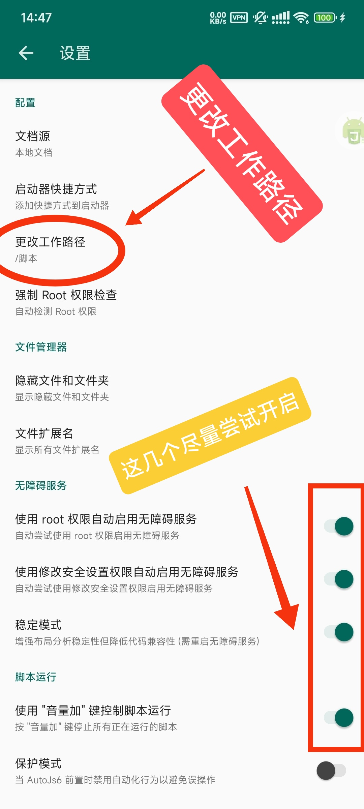
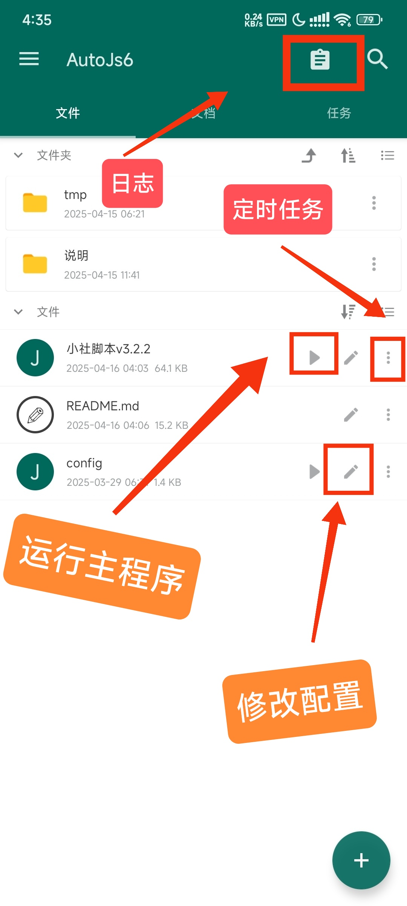
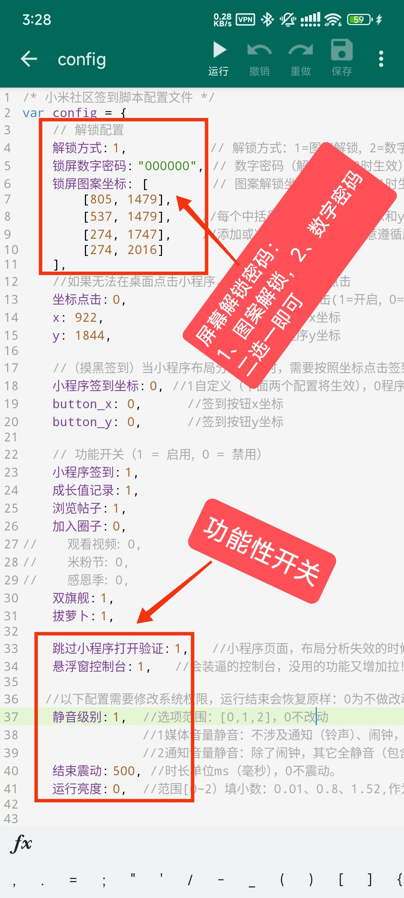
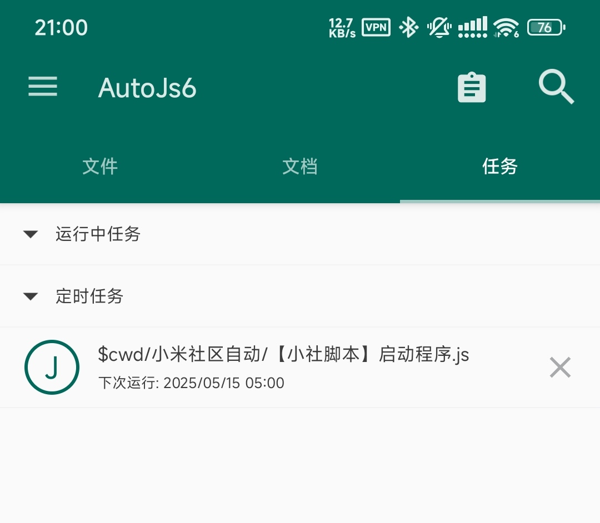
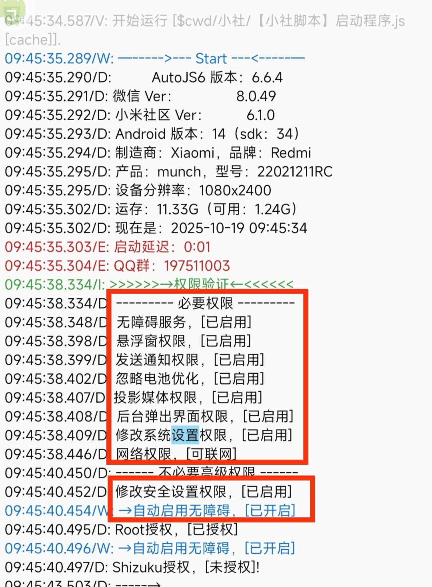
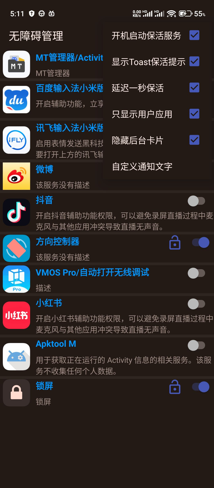

<div align="center">
<h1><a >小米社区自动化脚本【小社脚本】</a></h1>

</div>

## **项目介绍**
#### 原作者：  @PJxiaoyu  
#### 修改： 风中拾叶 
#### 三改： wengzhenquan
* 此脚本是基于AutoJs6，依靠安卓无障碍服务的小米社区自动化脚本
* 区别于青龙面板，该脚本免登录，模拟真人操作，类似“按键精灵”、连点器APP。
* 支持的功能：
  * 定时解锁手机（密码，图案）
  * 浏览帖子
  * 签到验证码识别（增强版，提高识别成功率，成功率90%）
  * 社区各种成长值任务
  * 小程序签到
  * 成长值记录
  * $\color{red}{多账号签到}$
  * $\color{red}{社区APP分身签到}$
  * ......

* $\color{red}{如果担心使用脚本会导致黑号，}$
$\color{red}{那么请不要使用此脚本。}$  

---  
## **效果展示：**  
  
  
  


--- 
## **正式开始：**  
**（请看完下面 $\color{red}{使用方法}$，和 $\color{red}{问题收集。}$ )**    
**(很多报错有中文提示，麻烦自己先看一眼。)**

--- 
### **社区APP下载 **(支持跳转小程序版)** ：**  
版本很多，但不一定兼容你的手机，社区APP若打不开、白屏或者有问题就换个版本，功能都差不多。  
白屏可查看下方 问题16

[网盘下载](https://www.123912.com/s/RYmDVv-bwUch)  

[备用地址](https://www.123865.com/s/RYmDVv-bwUch)   

   

--- 
## 使用方法：  

### **下载 AutoJs6 $\color{red}{(建议使用最新版)}$：**    
（最低支持6.6.2，额外兼容6.5.0）   
（不支持6.6.0、6.6.1）   

[官网下载](https://github.com/SuperMonster003/AutoJs6/releases)  

[123云盘渠道下载(推荐)](https://www.123912.com/s/RYmDVv-X3Sch)  

### **1. 先授权AutoJs6需要的权限。**  
   以下二选一：  
   * 无root：需要 $\color{red}{Shizuku}$ 。  
   * 有root：授权 $\color{red}{root权限}$ 。  
   
   **$\color{red}{下面2个权限需要Shizuku或root才能开启！}$**   
   * $\color{red}{1. 投影媒体权限}$(确保自动化截图）
   * $\color{red}{2. 修改安全设置}$(确保无障碍服务稳定）
   
   **$\color{red}{页面需要的权限看下图：}$**
      
    
   * $\color{red}{额外权限： 后台弹出界面权限}$   
    
   ``` 
   小米手机：长按AutoJs6图标→应用详情→权限管理
            →其它权限→后台弹出界面。  
   Vivo、Oppo：听说有。
   其它手机：不知道，有些手机不需要手动打开这个权限，默认允许。 
   ```  
--- 
### **2. 更改autojs6工作路径。**  
     
    
   目录允许使用中文，在`sdcard/`路径下。  
   
   **$\color{red}{右边框起来的前面2个，用于确保无障碍服务稳定}$** 
   至少要开第二个，配合开启“修改安全设置”权限(没有root，就用Shizuku开启)  

--- 
### **3. 将脚本解压到工作路径下。**  

### 【小社脚本】下载：

[在线加速下载版（推荐）](https://github.com/wengzhenquan/autojs6/releases/main)  

[123云盘渠道下载(小社脚本.zip)](https://www.123912.com/s/RYmDVv-X3Sch) 

[完整包下载](https://github.com/wengzhenquan/autojs6/archive/refs/heads/main.zip)   


   你可以修改`文件夹`名称，里面的`文件`别改名就行。  
   
   * 只需 $\color{red}{【小社脚本】一键更新程序.js}$或者 $\color{red}{【小社脚本】启动程序.js}$文件，即可自动下载所有文件。
     * 若`version`文件存在：对比版本文件，增量更新。  
     * 若`version`文件不存在：全量更新。（可删除或者重命名）   
   * 两个文件都具有检查/更新功能。(但核心更新功能由`【小社脚本】一键更新程序.js`提供)    
   * $\color{red}{更新下载完毕，下滑，可刷新文件列表}$

--- 
### **4. 在AutoJs6找到脚本，脚本如下：**  
     
   $\color{red}{在AutoJS6页面下滑，可刷新文件列表}$
   
--- 
### 文件结构：
```
/
├─ 【小社脚本】启动程序.js     (可独立运行)
├─ 【小社脚本】一键更新程序.js  (可独立运行)
├─ 【小社脚本】Run_x.x.x.js 
├─  config.js       # 配置文件
├─  version         # 版本信息
├─  tmp/            # 临时目录
└─  README.md       # 说明文档

  ---- (YOLO本地签到模块) ----  
  
└─  yolov11/     
   ├─  yolov11_w.js # 本地YOLO脚本(增强版)
   └─  model/       # 模型文件目录
      ├─  yzm.bin
      └─  yzm.param
Yolo-Plugins.apk     # Yolo插件(需安装）
```       

***若需要切换旧版本运行，只需修改version文件的run值即可：***  
``` 
   
"run": "【小社脚本】Run_3.x.x.js",
   
```
每次更新将保留2个历史版本，多的会自动删除。
若想要保留，请自己重命名备份。


--- 
### **5. 编辑配置文件 $\color{red}{config.js}$：**  
     
    
   设置屏幕解锁密码，能够设置定时任务，
   在夜间自动解锁进行签到。

   * 配置文件里面都有详细说明：  
     解锁方式是上滑解锁，不影响指纹解、人脸解锁，只要存在上滑解锁方式即可。 
      
     $\color{red}{锁屏壁纸的下半部分不能有太多组件，}$
     $\color{red}{否则可能上滑失败！}$  
     * **图案解锁：** 解锁方式：1
   
       ```
       依葫芦画瓢，有多少个点位，
       就多少行`[横坐标x, 纵坐标y]`。  
       按解锁顺序，从上到下排列。  
       ```
     * **数字(或混合)密码：** 将“解锁方式”改成2
       * **数字密码** ：“000000”改成你的数字密码
       * **混合密码(测试)** ：“000000”改成你的混合密码，仅支持 $\color{red}{数字和小写字母}$ 组合。
    
     * **没有密码：** 
       * 啥也不用管，程序会自动识别解锁状态。   
   
   * $\color{red}{图形锁的坐标获取方式：}$   
     * 方式一：开发者模式→指针位置(坐标绘制）
     * 方式二：(需要Shizuku或者root权限) 
   
       ```
       autojs6
         →左侧菜单（权限那一页）
         →浮动按钮（第3个），
           会看到一个悬浮小工具。  
       点击悬浮小工具
         →…(最后一个)
         →指针位置。    
       ```
           
       
--- 
### **6. 安装本地YOLO签到模块**  
   ``` 
   说明：在社区APP签到的时候，有一个验证码，识图点击坐标。  
       这个验证码需要AI识别图标，分析坐标，再根据坐标进行点击操作。  
       程序有两种识别方式，1本地YOLO签到识图，2服务器签到识图。  
       原理都是先截图，让ai去识别图片(截图会保存在tmp目录下）。  
   ``` 
   * 本地YOLO识图: 1，**(推荐，识别成功率95\%以上):** 
     * 需 $\color{red}{安装Yolo-plugin.apk}$插件，文件在yolov11目录下。($\color{red}{若没看到文件，可下滑刷新}$) 
    
   * 本地YOLO识图: 0(不推荐)：
     * 将启用服务器识图，图片会上传服务器。
      
     缺点如下：
     * 有网络延迟
     * 服务器过期
       * 现在只剩Claw Cloud Run免费容器。
       * 若有免费服务器、docker容器渠道，还请告知。  
       (服务器最低要求：1G内存、10G磁盘，  
       容器最低要求：1vCPU、1G内存)
         
   * $\color{red}{遇到报错，看下面 问题10——问题13}$
    
--- 
### **~7. 小米社区小程序图标，必须放在桌面~**  
   **$\color{red}{（社区APP若支持跳转小程序，可忽略该操作）。}$**  
   
   
   在微信小程序里面，右上角“…”→添加到桌面，即可。  
   **不可藏在文件夹里！！！**   
   ``` 
  
   坐标点击: 0,：（推荐）程序自动判断，若社区APP＞=5.3.2版本，使用社区跳转，否则使用桌面寻找图标。  

   坐标点击: 1,：（不推荐）从第3屏指定坐标点击启动小程序，坐标获取方法与上面一���。
              （如果你确定这样做了，那么图标必须放在第3屏！）  
              
   坐标点击: 2,：（推荐）强制使用桌面自动搜索所有屏。 
   
   ```   
   * 简单来说：
     * 坐标点击: 0，从社区APP跳转("去微信"按钮)
     * 坐标点击: 1，桌面第3屏，根据坐标点击图标
     * 坐标点击: 2，桌面自动搜索图标
   
   * 小米社区APP 5.3.2以上版本才支持从社区APP调用。  
   $\color{red}{本页开头已提供5.3.2以上版本下载地址}$  
   $\color{red}{本页开头已提供5.3.2以上版本下载地址}$  
   $\color{red}{本页开头已提供5.3.2以上版本下载地址}$  
   
   ```
   注：桌面自动搜索功能，如果在桌面上存在多个[小米社区]图标（微信分身，或社区APP），那么会选择位置顺序靠前面的那一个。    
      如果打开了社区APP，会回到桌面，然后尝试打开下一个图标，直到打开小程序为止。    
      **调换图标位置，让小程序图标靠前，无疑可以加快流程耗时。**     
      或者把社区APP图标藏进桌面的某个文件夹里，让程序找不到。
   ```
--- 

### **8.完成！试跑！定时任务！**   
  * **$\color{red}{建议定时任务时间设在 3点以后}$**  
    * 遇到紧急更新，会在凌晨发布。   
      比如：小米社区APP控件更改，需要更新代码。   
    * 正常更新会在0点之前。   
    * 晚上20点~凌晨3点是高峰期，代理延迟高，失效率高，更新慢，http请求慢。
    
   
  

  * 试跑：  
    配置好了以后，先试跑一下。   
    第一次试跑，把需要的权限都授权了。  
    确保脚本可以完成所有流程，然后设置定时任务。  
    **别忘了测试在锁屏状态下能否顺利解锁。**   
   ```  
    需保持 AutoJs6 后台运行, 
    包括 [ 自启动白名单 /
          忽略电池优化 / 
          忽略后台活动限制 / 
          系统多任务保留 ] 等.   
   ```  
   若有 $\color{red}{后台优化、墓碑}$等 $\color{red}{杀后台、冻结}$程序，需要加入 $\color{red}{白名单}$。
   
      
  * **$\color{red}{执行过程可能发生错误。}$**  
    出现任何问题，先查看本页面(README.md文件)下方的 $\color{red}{问题收集}$ ，下面收录了大多数遇到的问题，并且同时也在更新。   
    
  * 保证全自动化进行，必须打开 **$\color{red}{“投影媒体权限”}$**！（shizuku或者root）   
  * 想流程减少错误，请确保AutoJs6拥有 **$\color{red}{“后台弹出界面”权限}$**！   
   （小米手机肯定有打开入口，其它手机自己找找，如果没有，就确保“悬浮窗”、“显示在应用上层”等权限都开启！）    
 
  * 调试成功后，建议设置 **2个定时任务**，原因如下：   
    * 执行过程中可能发生错误。   
 
  * 程序运行耗时：1分20秒~2分30秒 
    * 不会超过5分钟，超过肯定就是出错了，程序会强制停止  
    * $\color{red}{设置多个定时任务，间隔至少5分钟}$
 
 
--- 
### **9. 扩展功能**   
   * 多账号：
     1. config.js中"启用多账号"改成1  
     2. 修改config_多账号.js配置文件，将账号改成自己的  
     
     
     注意：   
     1)不支持验证码登录  
     2)除了主账号(默认账号)，其它账号可能不支持小程序签到  
     3)若程序中途中断，将无法恢复成默认账号，需用户自己更换账号
     
   * 分身：  
   
     $\color{red}{设备必须要有 社区APP分身，}$
     社区APP分身要是登录不上账号，就没必要折腾了
     1. config.js中"启用分身"改成1
     2. config_多账号.js文件，重命名为 config_分身_x.js(x是序号，可以不要）  
     3. 可参考GitHub文件列表中的 config_分身.js
     4. 修改 config_分身_x.js
     
   * 双账号+双小程序签到(无社区APP分身，有微信分身)：   
   
     $\color{red}{只有两个账号，}$
     $\color{red}{但是无法社区APP分身，}$
     $\color{red}{又想两个账号都能小程序签到。}$   
     
     
     实际上多账号的小程序签到是能用的，只是不能切换账号，所以会反复签到同一个小程序账号。  
     
     当存在微信分身的时候，微信分身的小程序设置桌面图标，然后在config_多账号.js里，将“坐标点击”改成2(或者1)，从桌面图标打开小程序。。  
     
     这样一来，切换的所有账号都会从桌面打开小程序。   
     
     然而默认账号，遵守了config.js，从社区APP打开。   
     
     这样就完成打开了两个不同的小程序。   
     
     
     更适用于仅切换一个账号的时候，这样就完成了免社区APP分身，完成所有签到流程。   

--- 
### **10. 你还在等什么？哪来的9？赶快启动试试啊！成功了就定时任务甩起！**   
   
   一些额外辅助工具，正常都不需要用。
  
   www.123912.com/s/RYmDVv-A5uch
   
   提取码：GjHi
   
     
   

   

----   
## 问题收集：

#### 1. $\color{red}{布局分析失效}$ 是什么意思？   
   
   就是AutoJs6无法识别该页面的元素，比如“论坛”文本，“签到”按钮等等。  
   
   * 尝试开启：AutoJS6→设置→ **稳定模式**→重启无障碍服务  
   
   * 尝试开启：config配置→ **fast模式: 改成1**  
     (不一定有效，如果没问题不建议打开，打开说不定更差)  
     
   * 尝试关闭无障碍权限→重新授权无障碍权限→重启手机  
   
   
   ```    
   
   无法识别，也就无法判断这些元素是否已经加载、展示。  
   微信小程序里面，这个现象频发。   
   
   可能不兼容的因素：
     1、安卓版本
     2、AutoJS6版本
     3、微信版本(8.0.56开始的版本可能不兼容)
     
   
   ```  
   
    
#### 2. 什么是“ **排水沟过弯大法** ”？我的手机有时候无法启动小米社区？
   因为 $\color{red}{（缺少“后台弹出界面”权限）}$   
   长按AutoJs6图标→应用详情→权限管理→其它权限→后台弹出界面。  


#### 3.无法解锁屏幕/实际没有点击图标/实际没有点击……  
   
   $\color{red}{重新授权“无障碍”权限，然后重启手机，即可解决。}$   
   ```
   锁屏无法上滑；
   日志提示已点击，但实际上没有点击
   （比如识图认证，从桌面打开小程序图标）。
   这些都是“无障碍”权限故障导致的问题。
   
   可能是刚升级AutoJS6，需要重新授权。
   也有可能，就是无障碍权限掉了……
   看下一个问题
   
   ```
#### 4.无障碍服务已启用但未运行/无障碍服务老掉  
   
   ```
   1、确保开启'忽略电池优化'
      [[ 自启动白名单 / 
         忽略电池优化 / 
         忽略后台活动限制 / 
         系统多任务保留 ] 等.]
   2、重启无障碍服务
   3、重启手机
   ```
   --- 
   若有高级权限：（shizuku或者root）  
   * 配置文件 开启：{自动重启无障碍服务:1}→    
   * AutoJS6 开启 $\color{red}{修改安全设置}$权限(使用shizuku或者root)    
   * 然后开启以下设置(必须)   
   ```
   AutoJS6→设置：
     1、使用修改安全设置权限自动启用无障碍服务
     2、使用root权限自动启用无障碍服务
   ```
   
   --- 
   若有墓碑、杀后台程序，可以尝试加入白名单。    
   
   可以尝试开启 $\color{red}{前台服务}$、 $\color{red}{服务端模式}$。
 
   可以尝试第三方无障碍管理器用来保活，比如： **无障碍管理器** （酷安搜索，或上面第10步网盘链接有）   
   
   
#### 5.为什么我按[音量+/-]键无法停止脚本？  
   听说， **重启手机** 会有效果，一般人我不告诉他！
   
   ```  
   原因1： 监听音量键被占用。
        可以尝试AutoJs6→设置→打开“音量加”键控制脚本。
        开启、关闭，这个功能，尝试在开关这个按钮的情况下，脚本是否有效。
        反正我代码里面写了。
        被听音乐APP、看视频APP占用。
        被AutoJs6本身占用，也有可能无法激活。
        
   原因2： 可能被手机厂商限制监听功能。
        比如在小米澎湃2的环境下，该功能可能就失效。
        目前还没实现通过广播功能实现监听。
   
   ```
   
#### 6.打开AutoJS6就卡音量键？
   尝试：AutoJS6→设置→页面里有关于音量键的项目全关掉   
   尝试：`config.js` 配置文件→`音量键停止: 1` 改成0   
   
#### 7.为什么我点击`【停止脚本】`按钮无法停止脚本？显示“ **关不掉！x1** ”。  
   点击已经成功了， **继续点击** ，你一定可以停止成功的。
   
   ```  
   原因： 是AutoJS6设计上的问题，
         停止不能强制执行，只能通知式执行。
         在某些操作正在执行的时候，可能无法停止。
         最终结果不能确定。
         反正失败了就继续点就是。
         
   ```
   
#### 8. **要开始使用AutoJs6录制或投放内容吗？** 每次需要手动点“立即开始”或“下一步”。  
     
   $\color{red}{需要开启“投影媒体权限”，才能自动跳过这一步。}$  
   
   ```   
   免root用户(有Shizuku)：AutoJS6获得Shizuku授权，点击开启按钮，可直接开启。  
   
   root用户：AutoJs6获得root权限，点击开启按钮，直接开启。  
   ```
   
   
#### 9. **方法images.requestScreenCapture()**  调用失败。  
   （截图权限无法通过）
   
   这是 **“投影媒体权限”** 获取异常导致的。
   尝试以下方法之后，再运行脚本。 
   ``` 
   1、检查“`投影媒体权限`”，是否开启。
   2、重启AutoJs6。
   3、重启手机。
   ``` 
  
   
   
#### 10. **缺失yzm.bin、yzm.param文件**  
   ****/Yolo-plugin.apk插件未安装**** 
   
   这些是本地YOLO支持的文件。    
   目录结构本页上方（下载链接）位置有说明。   
   
   ``` 
   (将配置文件"本地YOLO识图: 1,"改成0，就不会提示)  
   本地YOLO加载失败的情况下，依旧使用连接服务器方式识图签到。   
   ``` 
   
   ***如果Yolo-plugin.apk已安装，依旧提示未安装，看下面问题12。***  
   
#### 11. **方法plugins.load调用失败**。  
   
   就是 $\color{red}{Yolo-plugin.apk未安装。}$ 
     
   `什么？已经安装了还是报这个错误？`   
   那你一定是root用户，且使用了`隐藏应用列表`。   
   将 Yolo-Plugins 加入白名单（或额外可见），让AutoJS6对其可见即可。  
   
#### 12. **[YOLO] yolo.init() 初始化失败！请检查模型路径、名称、标签及插件权限。**。
   
   没有意外的话，是GPU不兼容所导致，也有可能是在虚拟机中运行。   
   $\color{red}{请尝试将配置[YOLO启用GPU:1]改为0}$    
   
   
#### 13. 识图签到一直失败/点击顺序错误/识别的图标数量3/2/1/0。   

   * 确认验证码区域有没有遮挡，查看tmp/pic.png截图
     * 如果是悬浮窗控制台遮挡，可以将`悬浮窗控制台_签到高度`调小
       * 悬浮窗参数不能适配所有手机，大小在不同手机有不同效果
     * 如果上述无效，可以`悬浮窗控制台_签到时最小化`改成 1
   * $\color{red}{如果上述无效，再反馈}$

#### 14.更新的时候，一大堆报错， $\color{red}{OOM}$。   
   * OOM：内存溢出（AutoJS6内存不足)    
       * 并不是手机内存不足，只是AutoJS6自己限制了可用内存。    
       * 下载大文件的时候，没能及时释放内存，就有可能出现OOM。
   ``` 
   
   解决：AutoJS6左边菜单，最下面→重启
        只要关闭重启AutoJS6即可
        
   ```  
   
#### 15. **卡住了，不动了！**  
   
   1) 无障碍权限掉了，关闭无障碍权限，重新授权开启一下。
   2) 重启手机。
   3) 布局分析问题，可能安卓版本不兼容。
   4) 再不行当bug反馈
   
#### 16. **社区APP子页面全白屏**  

   尝试以下方法：
   1) 尝试更换APP版本
   2) 重启手机
   3) 使用爱玩机更换社区APP的安卓ID，然后重启手机
   4) 清除社区APP数据，重新登录账号
   
#### 17. **上滑失败，重试！**  
   $\color{red}{上滑起始位置}$ 改成1
   
#### 18. **空白页检查误报，实际上不是空白页**  
   $\color{red}{空白页检查}$ 改成0
   
#### 19. **小程序打开缓慢，被识别成布局分析失效，第二次执行又正常**  
   $\color{red}{小程序等待延迟}$ 增加等待时间，比如加5秒，10秒。


--- 


原作者  by：PJ小宇    QQ：898811295

修改    by：风中拾叶

三改   by：wengzhenquan（就是俺啦）   
github：https://github.com/wengzhenquan/autojs6
镜像一：https://bgithub.xyz/wengzhenquan/autojs6
镜像二：https://kkgithub.com/wengzhenquan/autojs6


--- 


 [更新历史](说明/更新历史.md)
